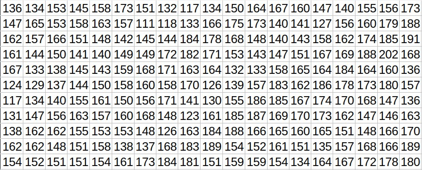

# Image Processing 

Before we dive into what is image processing lets first understand the fundamental element of Image Processing that is "The Image".

So __What is The Image?__
The image is a visual representation of a subject in two or three dimensions, usually a physical object, which provides a depiction of it.
The image can be two-dimensional such as a photograph or three-dimensional such as a hologram, objects in the VR system. 

In the field of Image Processing, we generally deal with __Digital Images__.  We acquire digital images using cameras (in some cases using scanned photo acquisition method), which can couple to optical devices such as telescopes, microscopes, etc. to capture the image. The camera is consists of a fixed number of rows and columns of tiny __light sensors (cavities)__ or __photosites__. These sensors capture the light and store it as an electrical signal in an array of picture elements, also known as pixels. Size of this array is equivalent to the number of light-sensors in the camera. Which means a digital image has a fixed number of rows and columns of _pixels_. Each pixel represents the intensity or a gray level of the light.

Let's look at a sample image.

This is a image of a coffee cup.

If we look closer to the bottom left corner of this image, you will see squares of individual colours.  These are the pixels captured by the light sensors in our camera.

In the computer, they represent an array of different values like this.

__The Pixel__ is the _smallest addressable_ element in the digital image. Pixels hold a _brightness_ of a given color at any specific point. In color imaging system color is represented by three or four component intensities such as _red, green, blue_ (RGB). 

As mentioned before, the digital image contains a fixed number of rows and columns of pixels. It means the digital image is a two or three-dimensional _array or matrix_ of pixels or intensity values as we saw earlier.  By performing the various mathematical operations on these matrices, we can extract different pieces of information from the image, such as the number of objects in the image their relative position, shape, size, etc. 

The process of _extracting information_ from the digital image using computation is known as __Digital Image Processing__.
